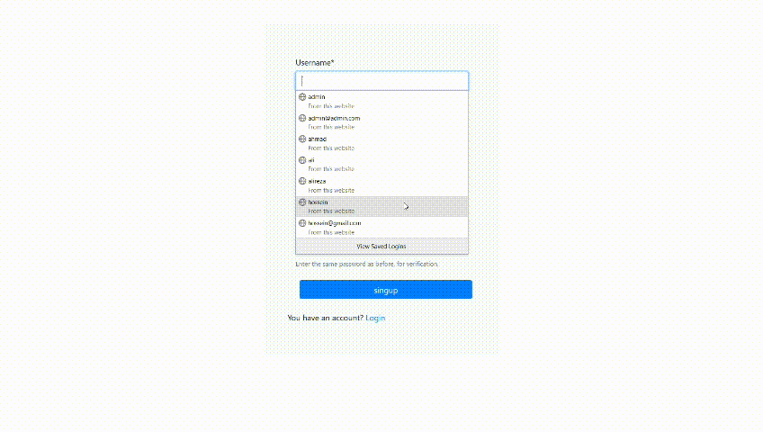

<h1 align="center">Django Todo Project</h1>
<p align="center">
<a href="https://www.python.org" target="_blank">  </a>
<a href="https://www.djangoproject.com/" target="_blank">  </a>
<a href="https://getbootstrap.com" target="_blank">  </a>
<a href="https://www.sqlite.org/" target="_blank">  </a>
<a href="https://www.docker.com/" target="_blank">  </a></p>

### Overview
- [Overview](#overview)
- [Features](#features)
- [Setup](#setup)
- [Getting ready](#getting-ready)
- [options](#options)
- [Reformat and check](#reformat-and-check)
- [Todo](#todo)

### Demo
This is a brief demo of the functionality of the project
<p align="center">

</p>

### Features
- Django LTS
- Class Based 
- User authentication
- Black
- Responsive Design
- Bootstrap4


# Development usage
You'll need to have [Docker installed](https://docs.docker.com/get-docker/).
It's available on Windows, macOS and most distros of Linux. 

If you're using Windows, it will be expected that you're following along inside
of [WSL or WSL
2](https://nickjanetakis.com/blog/a-linux-dev-environment-on-windows-with-wsl-2-docker-desktop-and-more).

That's because we're going to be running shell commands. You can always modify
these commands for PowerShell if you want.

### Setup
To get this repository, run the following command inside your git enabled terminal
```bash
git clone https://github.com/Hossein-YB/Django-Todo-App
```

### Getting ready
Create an enviroment in order to keep the repo dependencies seperated from your local machine.
```bash
python -m venv venv
```
Start docker, and go project directory in terminal after that run this command
```bash
docker-compose up --build
```


Wait for the project to run,after run go to the cloned repo  directory make new terminal and run the following command
```bash
docker-compose exec web sh -c "python manage.py makemigrations"
```

This will create all the migrations file (database migrations) required to run this App.

Now, to apply this migrations run the following command
```bash
docker-compose exec web sh -c "python manage.py migrate"
```

### options
Project it self has the user creation form but still in order to use the admin you need to create a super user.you can use the createsuperuser option to make a super user.
```bash
docker-compose exec web sh -c "python manage.py createsuperuser"
```

can start using our simple todo App, head over to http://127.0.0.1:8000 for the App.


### Todo
- [ ] leave comments for codes
- [ ] complete the documentation
- [ ] create a video tutorial

